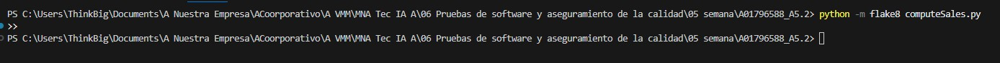
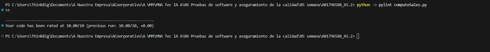
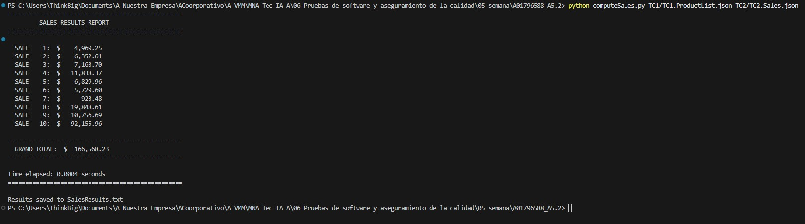
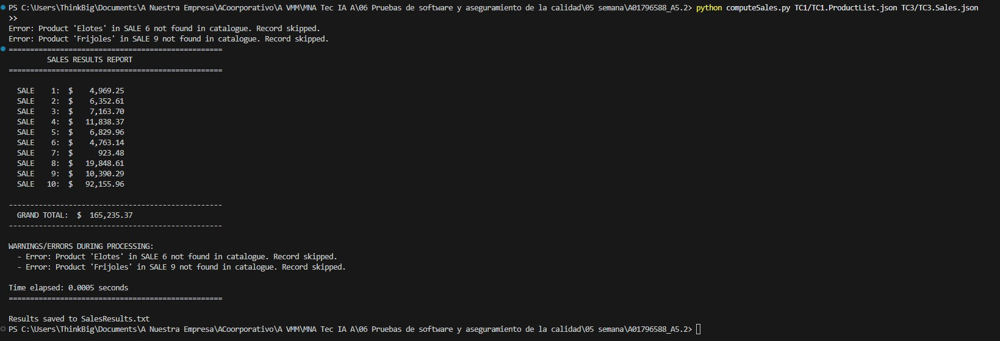

# Actividad 5.2 – Ejercicio de programación 2 (Compute Sales)
# María Virginia Mendizábal Miranda - A01796588

## Descripción
Este proyecto implementa el programa `computeSales.py`, el cual calcula el costo total de ventas a partir de dos archivos JSON:
1) Un catálogo de precios (ProductList / priceCatalogue).
2) Un registro de ventas (Sales).

El programa:
- Calcula el total por venta (SALE) y el gran total.
- Maneja datos inválidos (productos no encontrados, campos faltantes o cantidades inválidas) sin detener la ejecución.
- Muestra resultados en pantalla y los guarda en `SalesResults.txt`.
- Incluye el tiempo de ejecución.

## Estructura del proyecto
- `computeSales.py` – Programa principal.
- `SalesResults.txt` – Archivo de salida generado.
- `TC1/`, `TC2/`, `TC3/` – Casos de prueba (archivos JSON).
- `evidence/` – Evidencias (capturas de ejecución, flake8 y pylint).

## Requisitos
- Python 3.x
- Paquetes:
  - flake8
  - pylint

Instalación:
```bash
python -m pip install flake8 pylint
```

## Ejecucion

El programa se ejecuta desde la terminal con el siguiente comando:

```bash
python computeSales.py <priceCatalogue.json> <salesRecord.json>
```

Donde:
- `<priceCatalogue.json>` es el archivo JSON con el catalogo de productos y sus precios.
- `<salesRecord.json>` es el archivo JSON con los registros de ventas a procesar.

Ejemplo:
```bash
python computeSales.py TC1/TC1_ProductList.json TC1/TC1_Sales.json
```

## Evidencias

### 1. Analisis estatico con flake8 (0 errores)

Se ejecuto el linter **flake8** sobre `computeSales.py` para verificar el cumplimiento del estandar de estilo PEP 8. El comando utilizado fue:

```bash
python -m flake8 computeSales.py
```

El resultado muestra que **no se encontraron errores ni advertencias**, lo que confirma que el codigo cumple completamente con las convenciones de estilo de Python.



---

### 2. Analisis estatico con pylint (10.00/10)

Se ejecuto **pylint** sobre `computeSales.py` para evaluar la calidad del codigo. El comando utilizado fue:

```bash
python -m pylint computeSales.py
```

El resultado arroja una calificacion perfecta de **10.00/10**, indicando que el codigo cumple con todas las buenas practicas evaluadas por pylint: estructura, nomenclatura, documentacion (docstrings), manejo de excepciones y complejidad.



---

### 3. Ejecucion del Caso de Prueba 1 (TC1)

Se ejecuto el programa con los archivos del caso de prueba 1:

```bash
python computeSales.py TC1/TC1_ProductList.json TC1/TC1_Sales.json
```

**Resultado:** El programa proceso correctamente las 10 ventas del archivo de ventas, calculando el total individual de cada una (SALE 1 a SALE 10) y el gran total de **$2,481.86**. No se presentaron errores durante el procesamiento. El tiempo de ejecucion fue de **0.0003 segundos** y los resultados se guardaron exitosamente en `SalesResults.txt`.


---

### 4. Ejecucion del Caso de Prueba 2 (TC2)

Se ejecuto el programa con los archivos del caso de prueba 2:

```bash
python computeSales.py TC1/TC1_ProductList.json TC2/TC2_Sales.json
```

**Resultado:** El programa proceso correctamente las 10 ventas con montos significativamente mayores que en TC1. Los totales individuales van desde $923.48 (SALE 7) hasta $92,155.96 (SALE 10), generando un gran total de **$166,568.23**. No se presentaron errores durante el procesamiento. El tiempo de ejecucion fue de **0.0004 segundos** y los resultados se guardaron en `SalesResults.txt`.



---

### 5. Ejecucion del Caso de Prueba 3 (TC3 - con manejo de errores)

Se ejecuto el programa con los archivos del caso de prueba 3, disenado para validar el manejo de datos invalidos:

```bash
python computeSales.py TC1/TC1_ProductList.json TC3/TC3_Sales.json
```

**Resultado:** El programa detecto **2 productos inexistentes** en el catalogo:
- `'Elotes'` en SALE 6 - registro omitido.
- `'Frijoles'` en SALE 9 - registro omitido.

Estos errores se reportaron tanto en la salida estandar al inicio de la ejecucion como en la seccion **WARNINGS/ERRORS DURING PROCESSING** del reporte final. A pesar de los registros invalidos, el programa **no se detuvo** y continuo procesando el resto de las ventas. El gran total calculado (excluyendo los registros invalidos) fue de **$165,235.37**. El tiempo de ejecucion fue de **0.0005 segundos**. Esto demuestra que el programa maneja datos erroneos de forma robusta sin interrumpir la ejecucion.



---

## Conclusiones

### Objetivo de la actividad

El proposito de esta actividad fue desarrollar un programa en Python capaz de calcular el costo total de ventas a partir de archivos JSON, aplicando buenas practicas de programacion y aseguramiento de la calidad del software mediante herramientas de analisis estatico.

### Resumen de resultados

| Aspecto | Resultado |
|---|---|
| Analisis flake8 | 0 errores - cumplimiento total con PEP 8 |
| Analisis pylint | 10.00/10 - calificacion perfecta |
| TC1 (datos estandar) | 10 ventas procesadas - Gran total: $2,481.86 |
| TC2 (montos altos) | 10 ventas procesadas - Gran total: $166,568.23 |
| TC3 (datos invalidos) | 2 errores detectados y manejados - Gran total: $165,235.37 |

### Calidad del codigo

El codigo obtuvo resultados perfectos en ambas herramientas de analisis estatico:
- **flake8** verifico que el estilo del codigo cumple al 100% con el estandar PEP 8, sin errores ni advertencias.
- **pylint** evaluo la estructura, documentacion, manejo de excepciones y complejidad del codigo, otorgando la calificacion maxima de 10.00/10.

Esto garantiza que el programa es legible, mantenible y sigue las convenciones establecidas por la comunidad de Python.

### Funcionamiento y robustez

El programa demostro un correcto funcionamiento en los tres escenarios de prueba:
1. **TC1 y TC2:** Procesamiento exitoso de ventas con datos validos, calculando correctamente los totales individuales y el gran total.
2. **TC3:** Manejo robusto de datos invalidos (productos no existentes en el catalogo), reportando los errores de forma clara sin interrumpir la ejecucion del programa.

El programa cumple con los siguientes criterios de calidad:
- **Correctitud:** Los calculos de ventas y totales son precisos en todos los casos de prueba.
- **Robustez:** Los datos invalidos se manejan mediante excepciones, sin provocar que el programa se detenga.
- **Trazabilidad:** Los errores se reportan tanto en la salida estandar como en el reporte final, permitiendo identificar los registros problematicos.
- **Rendimiento:** Los tiempos de ejecucion fueron menores a 1 milisegundo en todos los casos, lo que refleja una implementacion eficiente.
- **Persistencia:** Los resultados se guardan automaticamente en `SalesResults.txt` para su consulta posterior.

---

## Bibliografia

### Python y estilo de codigo

- [PEP 8 – Style Guide for Python Code](https://peps.python.org/pep-0008/)
- [Python JSON Programming](https://pynative.com/python/json/)
- [Python Tutorial](https://docs.python.org/3/tutorial/index.html)

### Herramientas de analisis estatico

- [Flake8 Documentation](https://flake8.pycqa.org/en/latest/)
- [Python Static Analysis Tools](https://luminousmen.com/post/python-static-analysis-tools)

### GIT Commit Guidelines

- [Commit Early, Push Often](https://www.worklytics.co/blog/commit-early-push-often)
- [Conventional Commits 1.0.0](https://www.conventionalcommits.org/en/v1.0.0/)
- [Semantic Commit Messages](https://gist.github.com/joshbuchea/6f47e86d2510bce28f8e7f42ae84c716)
